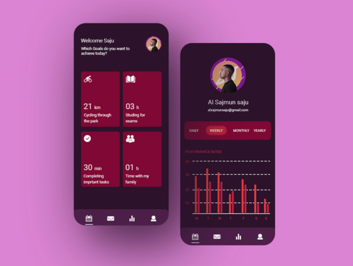

# Flutter ToDo UI

## Inspiration

So I saw this UI on dribbble and decided to make a few chnages to it

[App UIUX - ToDo App](https://dribbble.com/shots/17278575-App-uiux)

Shoutout to Al Sajmun Saju! You can contact him at alsajmunsaju@gmail.com.

# Who? Me?

I am Behon Baker. Just trying to share the love ❤.

You can find me here:

- [Behon Baker](https://behonbaker.com)
- 📧 behon.baker@yahoo.com
- [+1876 392-3910](tel:18763923910)

---

 

## Getting Started

This project is a starting point for a Flutter application.

A few resources to get you started if this is your first Flutter project:

- [Lab: Write your first Flutter app](https://flutter.dev/docs/get-started/codelab)
- [Cookbook: Useful Flutter samples](https://flutter.dev/docs/cookbook)

For help getting started with Flutter, view our
[online documentation](https://flutter.dev/docs), which offers tutorials,
samples, guidance on mobile development, and a full API reference.
